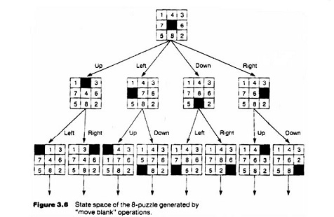

# Sliding Puzzle A* Solver

An AI-based Sliding Puzzle Solver developed in Python using the A* Search and Breadth-First Search (BFS) algorithms. The project demonstrates how heuristic and graph search techniques can efficiently solve the classic NxN sliding puzzle.

## State Space Representation

The figure below illustrates the state space of the 8-puzzle, showing how different moves generate new puzzle configurations during the search process.



## Features

- A* Search Algorithm
- Breadth-First Search (BFS)
- Supports NxN sliding puzzles
- Manhattan Distance heuristic
- Misplaced Tiles heuristic
- Object-Oriented Python implementation
- Command-line interface

## Technologies Used

- Python 3
- NumPy
- Artificial Intelligence
- A* Search
- Breadth-First Search (BFS)

## Project Structure

```text
Sliding-Puzzle-A-Star-Solver/
│
├── game_state.py
├── solver.py
├── sliding_puzzle.py
├── requirements.txt
├── .gitignore
├── README.md
└── images/
    └── state_space.jpg
```

## Installation

Clone the repository:

```bash
git clone https://github.com/ishaarain03/Sliding-Puzzle-A-Star-Solver.git
```

Move into the project folder:

```bash
cd Sliding-Puzzle-A-Star-Solver
```

Install the required dependencies:

```bash
pip install -r requirements.txt
```

## Running the Project

Display the help menu:

```bash
python sliding_puzzle.py -h
```

Run the project using the A* algorithm:

```bash
python sliding_puzzle.py -n 3 --mx 10000 --heur manhattan --astar
```

Run the project using the BFS algorithm:

```bash
python sliding_puzzle.py -n 3 --mx 10000 --heur manhattan --bfs
```

## Heuristics

The project supports two heuristic functions:

- Manhattan Distance
- Misplaced Tiles

## Algorithms

- A* Search
- Breadth-First Search (BFS)

## Future Improvements

- Add a Graphical User Interface (GUI)
- Support additional search algorithms
- Compare algorithm performance
- Add visualization of the search process

## Author

**Isha Saleem**

BS Computer Science  
The Shaikh Ayaz University, Shikarpur
